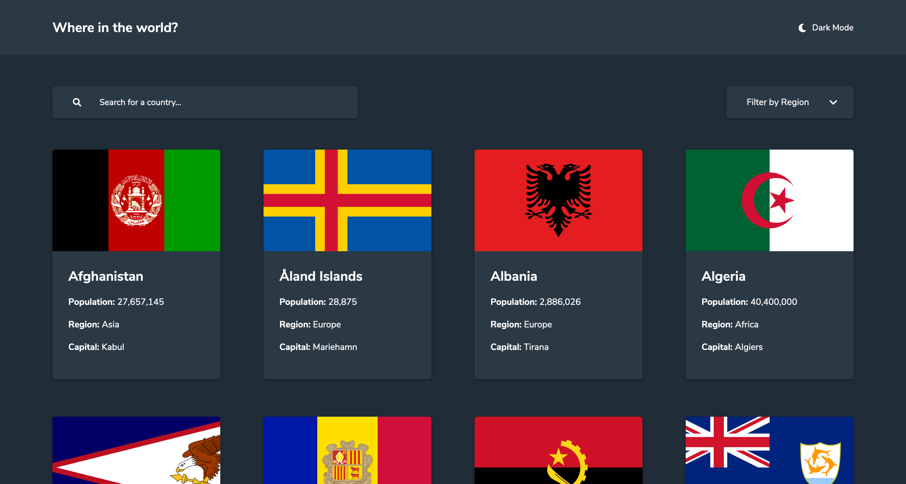

# REST Countries API with color theme switcher solution

This is a solution to the [REST Countries API with color theme switcher challenge on Frontend Mentor](https://www.frontendmentor.io/challenges/rest-countries-api-with-color-theme-switcher-5cacc469fec04111f7b848ca).  

## Table of contents

- [Overview](#overview)
  - [The challenge](#the-challenge)
  - [Screenshot](#screenshot)
  - [Links](#links)
- [My process](#my-process)
  - [Built with](#built-with)
  - [What I learned](#what-i-learned)
  - [Continued development](#continued-development)
  - [Useful resources](#useful-resources)
- [Author](#author)
- [Acknowledgments](#acknowledgments)

## Overview

### The challenge

Users should be able to:

- See all countries from the API on the homepage
- Search for a country using an `input` field
- Filter countries by region
- Click on a country to see more detailed information on a separate page
- Toggle the color scheme between light and dark mode *(optional)*

### Screenshot

### Links

- [Solution URL](https://github.com/RabWinter/rest-countries-api)
- [Live Site URL](https://rest-countries-api-henna.vercel.app/)

## My process

### Built with

- Semantic HTML5 markup
- CSS/SCSS
- JavaScript
- Flexbox
- Grid
- Mobile-first workflow

### What I learned

I gained good experience in retrieving and displaying data from a large API. In particular, in order to access the full names of the border countries I had to make another API call specifically for the country alpha codes and tie these in the with country names. Border country names were not given in the data base, only the alpha codes.

On reflection, although the site works I am currently rebuilding this project using REACT. This will be my first real venture with the framework and I feel it will allow me to write more modular, reuseable code.

## Author

- Website [rabwinter.com](https://rabwinter.com)
- Frontend Mentor [@Rwinter88](https://www.frontendmentor.io/profile/Rwinter88)
- LinkedIn [Rab Winter](https://www.linkedin.com/in/rab-winter-4498a977/)
